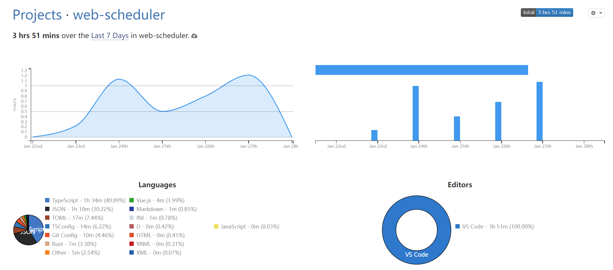

# 软设日志 - 0

> 因为一个人打比赛很无聊，所以专门开个日志记录一下每周工作的进度。

<!-- more -->

由于工作很散加时间跨度很长，所以就合起来讲了，之后会以周为单位展开，写到开学为止aww。

## 项目前期规划

这个项目和我的计网大作业实质上是一样的，本来是其实两者应该对调一下，但中途考虑了一下工程量的问题，于是废弃了原有的计划。

本项目的前身应该是我平时自写自用的脚本，不过由于脚本写的太烂了，加之原本没打算做成一个大型项目，所以谈不上可读性与维护性。在思考大作业的时候，打算将其重构一下，花了一点时间构思项目规划后，写着写着发现项目与计网的相关性不是特别强，之后构思软设的时候，也是写完规划发现整体技术水平不高，考虑到当时有五六门课还没考，时间紧迫便将两个草案对调了一下（期间还改了项目的名称aww），大作业那边总共花了差不多三十小时左右完成了基础模块构建混完了作业，~~后面有时间就再维护吧，毕竟只打算按作业的要求来做。（其实大作业本身也是个试水）~~说回软设，完成计网作业后，之后忙于应付考试就没继续构思了，加之后来的实践无缝衔接期末，时间转眼从正月初来到了正月末，然后又是春节将近，这个项目就在稀里糊涂中定了下来。

> 这个项目真正用来规划的时间实际上只有去年年末和今年年初的几天，之后就是 水痘隔离 -> 超长期末周 -> 实践 qaq
>
> 当然，要说的话，实践期间搭建环境时零星的修补也算规划的一部分。

总的来说，虽然目前整个还是依托糨糊，不过大体的框架已经有了：

- 工程化的全栈项目
- 经典的重复造轮子
- 为屎山预留的设计
- 无止尽的边学边做
- ......

## 项目结构

> 出于比赛的考量只列出了一级目录，未来也会开源的（黑历史 & 屎山 ++）。
>
> 忘了给 tree-cli 调配置了，导致输出的时候按字母顺序排了x，不过算了，反正也能看懂x。

```txt
web-scheduler
├── Cargo.lock
├── Cargo.toml
├── dist/
├── docs/
├── env/
├── index.html
├── LICENSE
├── node_modules/
├── package.json
├── pnpm-lock.yaml
├── public/
├── README.md
├── server/
├── src/
├── target/
├── tsconfig.json
├── tsconfig.node.json
└── vite.config.ts
```

具体功能啥的我就不多讲了，反正应该能看懂x，如果疑惑的话未来可以看~~后日谈？~~

## 小结

项目规划的内容早在此前就安排好了，这一周主要是项目环境的搭建，实践中忙里偷闲搞的，目前来看应该是搭好了，花了大概 4hrs 左右（汗），由于还没测试过，所以具体好不好用咱也不知道x。



还没正式写已经开始掉毛了（脱发严重aww）qaq，反正我和项目有一个能跑就行x。

<p class="center-text">「俺も頑張らないと。」</p>

---

Mygo 好看的ne。
